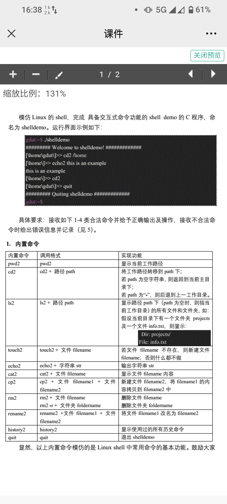
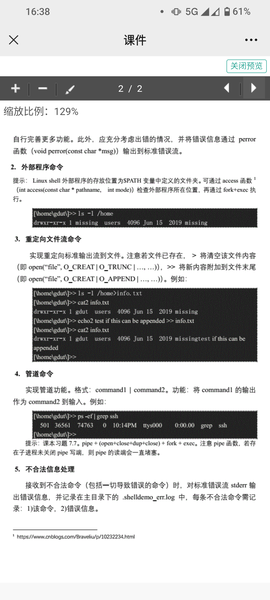

# shell-demo

> A tiny Linux shell practice

模仿Linux的Shell，完成具备交互式命令功能的shell
demo的C程序，命名为shell-demo

> 运行界面示例：

```shell
===== Welcome to Allen's shell demo! =====
[Allen@shelldemo: /home/Allen]% echo2 this is an example
this is an example
[Allen@shelldemo: /home/Allen]% cd2
[Allen@shelldemo: /home/Allen]% quit
===== Goodbye from shell demo! =====
```

具体要求：接收如下4类合法命令并给予正确输出及操作，接收不合法命令时给出错误信息并记录。
应充分考虑出错的情况，并将错误信息通过perror函数(void perror(const char \*msg))输出到标准错误流

## 1.内置命令

> 说明：

### 内置命令

- 调用格式
- 实现功能

以下为需实现的命令：

### pwd2

- pwd2
- 显示当前工作路径

### cd2

- cd2 + 路径path
- 将工作路径转移到path下；若path为空字符串，则返回到当前主目录下；若path为“-”，则后退到上一工作目录

### ls2

- ls2 + 路径path
- 显示路径path下（path为空时，则指当前工作目录）的所有文件和文件夹，如：
  假设当前目录下有一个文件夹projects及一个文件info.txt，则显示：

```shell
 Dir: projects/
File: info.txt
```

### touch2

- touch2 + 文件filename
- 若文件filename不存在，则新建文件filename；否则什么都不做

### echo2

- echo2 + 字符串str
- 输出字符串str

### cat2

- cat2 + 文件filename
- 显示文件filename内容

### cp2

- cp2 + 文件filename1 + 文件filename2
- 新建文件filename2，将filename1的内容拷贝到filename2中

### rm2

- rm2 + 文件filename; rm2 -r + 文件夹foldername
- 删除文件filename；删除文件夹foldername

### rename2

- rename2 文件filename1 文件filename2
- 将文件filename1改名为filename2

### history2

- history2
- 显示使用过的所有历史命令

### quit

- quit
- 退出shell-demo

## 2.外部程序命令

Linux shell外部程序的存放位置为$PATH变量中定义的文件夹。
可通过access函数(int access(const char \*pathname, intmode))检查外部程序所在位置，
再通过fork+exec执行。
如：

```shell
[Allen@shelldemo: /home/Allen]% ls -l /home
drwxr-xr-x 1 Allen  users  4096  Jun 15   2019  missing
```

## 3.重定向文件流命令

实现重定向标准输出流到文件。注意若文件已存在，
/> 将清空文件内容（即open("file", O_CREAT|O_TRUNC|..., ...)），
/>/> 将新内容附加到文件末尾（即open("file", O_CREAT|O_APPEND|..., ...)）。
例如：

```shell
[Allen@shelldemo: /home/Allen]% ls -l /home>info.txt
[Allen@shelldemo: /home/Allen]% cat2 info.txt
drwxr-xr-x 1 Allen  users  4096  Jun 15   2019  missing
[Allen@shelldemo: /home/Allen]% echo2 test if this can be appended>>info.txt
drwxr-xr-x 1 Allen  users  4096  Jun 15   2019
missing test if this can be appended
```

## 4.管道命令

实现管道功能。格式：command1 | command2。
功能：将command1的输出作为command2的输入。例如：

```shell
[Allen@shelldemo: /home/Allen]% ps -ef|grep ssh
    501  36561  74763  0  10:14PM  ttys000  0:00.00  grep  ssh
```

提示：pipe+(open+close+dup+close)+fork+exec。注意pipe函数，若存在子进程未关闭pipe写端，则pipe的读端会一直堵塞

## 5.不合法信息处理

接收到不合法命令（包括一切导致错误的命令）时，对标准错误流stderr输出错误信息，
并记录在主目录下的.shelldemo_err.log中，每条不合法命令需记录：1) 该命令，2) 错误信息




